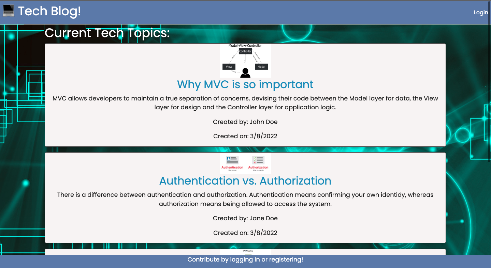
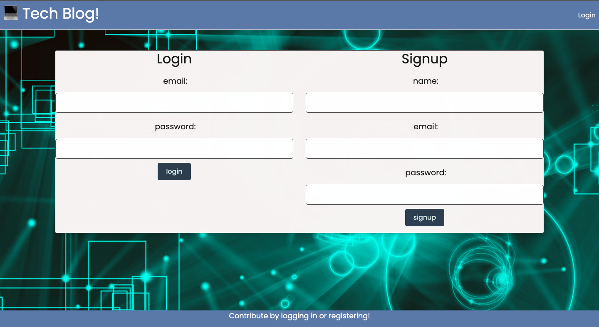
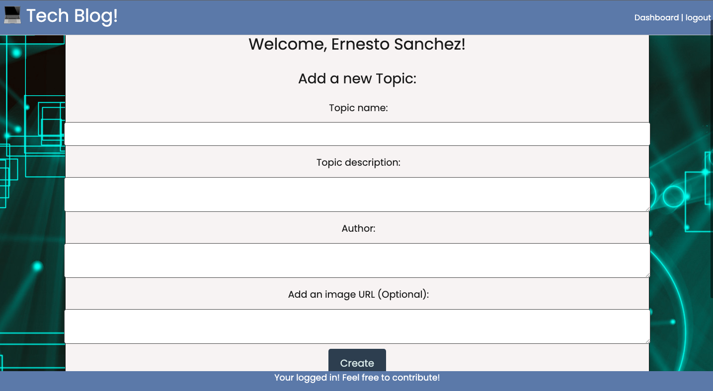
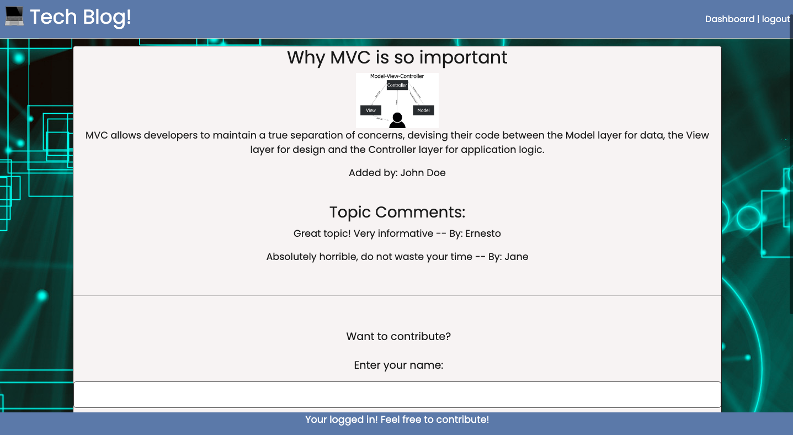

# Tech Blog APP using Modal View Controller (MVC)

[](https://opensource.org/licences/MIT)

## Description

Writing about tech can be just as important as making it. Developers spend plenty of time creating new applications and debugging existing codebases, but most developers also spend at least some of their time reading and writing about technical concepts, recent advancements, and new technologies. A simple Google search for any concept covered in this course returns thousands of think pieces and tutorials from developers of all skill levels!
This app is a CMS-style blog site similar to a Wordpress site, where developers can publish their blog posts and comment on other developers’ posts as well. It has been deployed it to Heroku. This app follows the MVC paradigm in its architectural structure, using Handlebars.js as the templating language, Sequelize as the ORM, and the express-session npm package for authentication.

## Table of Contents

- [User Story](#userstory)
- [Screen Shots](#screenshots)
- [Installation](#installation)
- [Usage](#usage)
- [License](#license)
- [Contributing](#contributing)
- [Tests](#tests)
- [Questions](#questions)

## User Story

AS A developer who writes about tech
I WANT a CMS-style blog site
SO THAT I can publish articles, blog posts, and my thoughts and opinions

## Screenshots






## Installation

This project uses npm packages:

```
npm i
```

```
open mysql by entering mysql -u root -p then entering password followed by
```

```
source schema.sql
```

```
back in server terminal enter: node seeds/seed.js
```

```
Finally run
```

```
npm start
```

## Usage

To run tests, run the following command:

```

node server.js

```

## License

    License is MIT standard license.

## Contributing

It is an open project and everyone can contribute - please send and email requesting to be added as a contributor

## Questions

If you have any questions about the repo, open an issue or contact [ernestosanchezCS](https://github.com/ernestosanchezCS/) directly at ernestosanchez8888@gmail.com.
